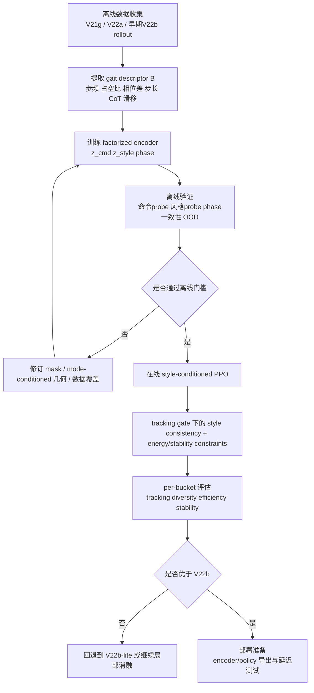

# 当前项目路线的形式化审视与近五年文献对照报告

**Executive summary：**当前 V22b 路线**部分可行**：它与近五年的三条主线高度一致——冻结表征用于控制、几何化/可控技能表征、以及受约束的内在奖励——因此继续 20k 训练与系统消融是合理的；但现有 Iso/A1/A2/Var 仍不足以保证“有用的 sub-style emergence”。最大缺口不是 encoder 本身，而是缺少对 **residual 是否被 actor 使用、是否对应稳定周期步态、是否只是高能噪声** 的可证伪判据。建议把未来两到三周的重点从“再训更久”转到“先证明因果链闭环”，若闭环失败，再转入 V23 条件式重设计。citeturn2search2turn7search2turn17search1turn17search2turn26search1turn25search0turn24search1turn8search2

## 文献图谱

近五年的相关工作大体收敛到三条相邻但并不相同的路线。第一条是**冻结预训练表征再接控制器**：如 R3M 和 MVP，都先在外部数据上学表示，再把 encoder 冻结用于下游控制；R3M 在模拟和真实操控上报告了比从头训练和通用视觉表征更好的样本效率与成功率，MVP 则展示了“冻结视觉 encoder + RL/BC 控制器”在多种像素控制任务上的强竞争力。第二条是**奖励无关的技能/表征预训练**：如 APS、CIC、PEAC、ExORL，强调在 reward-free 阶段先获得可迁移的行为或表征，再做适配。第三条是**把 latent 空间做成有几何或结构意义的空间**：如 LSD、CSD、METRA、DUSDi、Gaitor、PSD、RGSD 等，它们分别从 Lipschitz、controllability、temporal metric、factorization、periodicity、reference grounding 等角度，试图让 latent 不只是“能压缩”，而是“能决定后续行为的结构”。citeturn2search2turn7search2turn29search0turn4search1turn18search0turn2search0turn24search1turn25search0turn26search1turn9search0turn8search2turn23search0turn22search0

与这些工作相比，V22b 的位置很特殊：它**不是**像 R3M/MVP 那样“只把 frozen encoder 当特征提取器”，也**不是**像 CIC/LSD/CSD/METRA 那样“在线同时学习 skill latent 与 intrinsic reward”，而是把**离线学好的 gait encoder**接到 actor，同时把 **残差几何 \(z-g^\*(v)\)** 直接做成在线 reward shaping。就检索到的近五年文献而言，这种“**冻结 gait encoder + 全局轴向预测器 + residual norm intrinsic**”的组合并没有一个同构工作；最接近的邻域分别来自 frozen representation、metric latent、controllability-aware skill discovery 和 locomotion-specific structured latent。换句话说，V22b 不是“没先例”，但它是一个**跨路线拼接**出来的新设计。citeturn2search2turn7search2turn4search1turn24search1turn25search0turn26search1turn8search2

同样重要的是，文献对“冻结 encoder 是否一定优于在线学习”给出的结论并不单向。Hansen 等人指出，一个经过强化的数据增强和浅层网络的从零学习基线，往往比看上去要强，很多 frozen PVR 的优势会被**预训练数据与下游任务之间的 domain gap** 抵消，而且微调通常能缓解这种问题。Majumdar 等人的 CortexBench 进一步发现，没有任何单一预训练视觉表征在 embodied AI 全部任务上都占优。Schneider 等人则在 2024 年指出，到了 model-based RL，现有 PVR 甚至可能在样本效率和 OOD 泛化上都不如从头学，数据多样性和网络结构反而更关键。对当前项目，这意味着：**frozen V3 encoder 作为起点是合理的，但绝不等于“冻结就赢了”**；如果离线数据覆盖不够、on-policy 分布偏移太大，frozen encoder 可能会把 blind spot 也一并冻结下来。citeturn17search1turn6search1turn17search2turn2search0

下表把与你当前问题最相近的文献轴线做一个对照。表内“masking”一列特意区分了**通用 masked modeling**与**你项目中的 strict leakage mask**：前者的目标多是提高上下文表示质量，后者的目标是阻断命令泄露，两者不能混为一谈。citeturn31search0turn7search2turn32search0

| 方向 | 代表工作 | 关键假设与目标 | 关键损失/奖励 | masking / latent 结构 | 在线 vs 离线 | 对当前项目的启示 | 来源 |
|---|---|---|---|---|---|---|---|
| 冻结预训练表征 | R3M；MVP | 大规模预训练表示可迁移到下游控制 | 时间对比/语言对齐（R3M）；masked modeling（MVP） | 通常冻结 encoder；latent 主要服务下游任务 | 先离线预训练，再在线/离线控制 | 支持“先学表征、后接 policy”的总体思路 | citeturn2search2turn7search2 |
| 冻结表征的边界 | Hansen 2023；CortexBench；Schneider 2024 | frozen PVR 并不总优；domain gap 和任务错配很关键 | 对比 frozen PVR 与 strong LfS / model-based 控制 | 多数不强调因果 masking | 多为离线预训练 + 下游学习 | 说明 V22a 打平并不意外，也说明 V22b 若无额外因果证据，不能仅靠“有 z”证明有效 | citeturn17search1turn6search1turn17search2 |
| 奖励无关预训练 | APS；CIC；ExORL；PEAC | 先做 reward-free 预训练，再快速适配 | MI、successor features、contrastive intrinsic、数据驱动探索 | latent/skill 往往与任务无关或弱任务相关 | 多为在线预训练，也有数据中心方法 | 说明“先学可迁移表示/行为，再接任务”有坚实基础，但 V22b 的 residual shaping 与这些方法并不相同 | citeturn29search0turn4search1turn2search0turn18search0 |
| 动态技能与幅值约束 | LSD | 纯 MI 技能发现偏好静态/容易的技能，应显式鼓励远距离、动态行为 | Lipschitz-constrained skill objective | 强调 latent 距离与可达状态变化的关系 | 在线 | 直接支持你把 A2 当核心约束；但也提示“仅上界 Lipschitz 不够”，需要防 collapse 的下界或单调性判据 | citeturn24search1 |
| 可控而非仅多样 | CSD | 应奖励“更难控制、但可达”的行为，而不是所有变化 | controllability-aware distance + distance-maximizing skill discovery | 强调由当前技能库估计 controllability | 在线 | 与 V22b 最接近的启发是：**residual 不能只大，还要对 policy 可用、对行为有因果** | citeturn25search0turn25search2 |
| 几何化 latent 空间 | METRA；HILP；Dual Goal | 学一个与 temporal distance / dynamics 结构一致的 latent 几何 | metric-aware abstraction；Hilbert/directional movement；dual temporal relation | latent 空间带方向/距离语义 | 主要是预训练或 goal 条件化 | 直接支持 Iso/A1 的几何思路，但也暗示全局线性轴可能太强，局部 chart 或 mode-conditioned 几何更自然 | citeturn26search1turn27search1turn27search7 |
| 因子分解与可控/不可控分离 | DUSDi；DUCF | 技能或特征应分解成能独立作用于状态因子的部分 | factorized components；contrastive + adversarial partition | 明确拆分可控与不可控子空间 | 在线或离线辅助 | 支持把 residual 从“任意方差”升级为“行为可解释残差”；若要升级 V22b，这一类工作最值得借鉴 | citeturn9search0turn14search0 |
| locomotion 特化结构 | Gaitor；Data-driven latent biped；SLR；Constrained Skill Discovery；PSD；RGSD | 步态 latent 应可解释、可连续过渡、可保留周期/语义结构 | VAE/autoencoder；distance constraint；circular latent；reference grounding | disentangled gait latent、周期 latent、reference manifold | 既有离线也有在线 | 这些工作共同说明：对 locomotion，仅靠“残差大”通常不够，**周期性、语义性、mode 结构**往往要单独建模 | citeturn8search2turn10search0turn19search17turn20search0turn23search0turn22search0 |
| masking 策略 | MLR；MVP | mask 可以提升上下文表示学习 | mask-based latent reconstruction；masked image modeling | 多是随机空间/时间 mask | 在线辅助或离线预训练 | 你的 strict mask 更像“防泄露因果 mask”，这比常见 mask 更对题，但仍不能自动保证 residual 是 style 而非命令代理变量 | citeturn31search0turn7search2 |

从这张表可以得到一个很重要的判断：**V22b 的大方向并不违背文献共识，但它缺了一个文献里反复出现的环节——把“latent 的残差”与“真实、稳定、可控的行为差异”绑定起来。**LSD 给了“动态性”，CSD 给了“可控性”，PSD 给了“周期性”，RGSD 给了“语义地面”，Gaitor 给了“解释性 gait manifold”。而 V22b 当前最强的东西其实是“几何分解”，最弱的则是“行为绑定”。citeturn24search1turn25search0turn23search0turn22search0turn8search2

## 形式化规约审视

以下分析把你给定的实现设定视为当前事实：离线训练 strict-mask 的 frozen V3 encoder，在线仅把 \(z\in\mathbb{R}^{32}\) 接入 actor，critic 不看 \(z\)，V22b 用 \(r_{\text{int}}=\|z-g^\*(v)\|^2/d\) 再经 alpha schedule 和 SMERL gate 加到环境奖励。由于本轮未提供源码或内部文档，这些实现细节不再单独外部核验。基于这个前提，我建议把目标正式写成四个条件的联合，而不是仅仅“tracking + residual bonus”：

\[
\begin{aligned}
&\text{Tracking: } \mathbb{E}[\ell_{\text{track}}(C,\tau)] \le \varepsilon,\\
&\text{Style capacity: } I(B;Z_r \mid C,M) > 0,\\
&\text{Style usability: } I(A_t; Z_r \mid O_t,C_t,M_t) > 0,\\
&\text{Safety/efficiency: } \mathbb{E}[\ell_{\text{stab}}+\lambda \ell_{\text{energy}}] \le \kappa,
\end{aligned}
\]

其中 \(C=(v_x,v_y,\omega_z)\)，\(M\) 是 3-way mode，\(H_t\) 是历史窗口，\(Z=E(H_t)\)，\(Z_r=Z-g^\*(C)\)，\(B\) 是从轨迹中提取的 gait descriptor（建议至少包括步频、占空比、左右相位差、步长、横摆/侧摆幅度、CoT、滑移率）。这个形式化比现有约束多出的关键项是 **usability**：如果 actor 不使用 residual，或者 residual 只对应噪声，那么即便 Var 很大，项目目标也没有达成。这个判断与近年的 state representation 综述、自监督辅助任务分析，以及 controllability/periodicity 方向的文献是一致的。citeturn32search0turn16search0turn25search0turn23search0

下表逐个审视当前四个形式化约束。

| 约束 | 是否必要 | 是否充分 | 主要盲点 | 推荐判据 |
|---|---|---|---|---|
| **Iso**：\(d_Z\) 排序保持 \(d_C\) | **局部必要，全球不一定必要**。如果完全不保命令几何，latent 会丢掉“速度条件” | **不充分**。它只说明命令差异可见，不说明 style 差异可用 | 全局等距可能压扁 mode 内的风格自由度；若 3-way mode 已明示分段结构，则更像 piecewise manifold，不像单一全局 chart | 局部 KNN rank correlation、trustworthiness/continuity、分 mode 的命令-几何一致性 |
| **A1**：存在 3 个 axial bases 解释命令子空间 | **有用但不严格必要**。它提供强 inductive bias | **不充分**。即便 \(g^\*(c)\) 可拟合，残差仍可能是噪声 | 真实命令流形可能是 mode-conditioned、曲的、甚至局部线性的；全局 3 轴可能过强 | 比较全局 \(g^\*\) vs mode-conditioned \(g^\*_m\) vs 局部 MLP 的 held-out \(R^2\)、残差各向异性、principal angle drift |
| **A2**：幅值 Lipschitz，不让同方向不同速率 collapse | **必要**，但应改写成“下界不塌缩”的**bi-Lipschitz / monotone radial sensitivity** | **不充分**。只保证速度幅值可分，不保证学到的是 gait style | 单纯“上界 Lipschitz”只防爆炸，不防 collapse；而你的目标需要“越快/越慢真的映到可区分行为” | 命令径向单调性、局部斜率 \( \partial \|z\|/\partial \|c\|>0 \)、radial ordinal accuracy、same-direction collapse rate |
| **Var**：同命令桶内保留方差 | **必要**，否则没有 sub-style 容量 | **明确不充分**。方差可以来自噪声、接触抖动、能量浪费、随机扰动 | “有方差”不等于“有风格”；还需要残差与步态描述符相关、对动作有因果作用、在时域上稳定 | \(R^2(B\mid C,Z_r)-R^2(B\mid C)\)、\(R^2(C\mid Z_r)\) 低、跨 episode 重复性、频域一致性、z-shuffle 干预效应 |

基于上表，可以更明确地说：**当前四约束是“必要性偏多、充分性不足”的一组规约。**尤其是 A2 和 Var，看起来像在鼓励“别塌缩、别太像命令”，但这离“产生结构化步态分化”还差一层“行为语义与可控性”约束。LSD、CSD、PSD、DUSDi 和 Gaitor 分别提供了这层缺失约束的不同版本：动态性、可控性、周期性、因子化和 gait 语义可解释性。citeturn24search1turn25search0turn23search0turn9search0turn8search2

我建议把下面这些假设都改成**可证伪假设**，并以表中判据作为硬门槛，而不是只看总 reward 或 \(r_{\text{int}}\)。

| 假设 | 若为真，应观察到什么 | 最小检验实验 | 建议成功判据 |
|---|---|---|---|
| **H1：\(Z_r\) 承载的是 style，而不是命令残差代理变量** | 在控制住 \(C,M\) 后，\(Z_r\) 仍显著提升对 gait descriptor \(B\) 的预测；但单独用 \(Z_r\) 预测命令应较弱 | 线性 probe / 小 MLP：\(B\leftarrow (C,M)\) 与 \(B\leftarrow(C,M,Z_r)\)；以及 \(C\leftarrow Z_r\) | \(\Delta R^2_B > 0.10\) 且 \(R^2_{C\leftarrow Z_r}<0.20\) |
| **H2：actor 真的使用了 \(Z_r\)** | 固定 observation 与命令，替换 \(Z_r\) 会明显改变动作或行为 | eval 时做 z-shuffle / mean-z / cross-bucket z 替换 | 目标 bucket 中 action L2 变化显著，且 gait descriptor 改变大于 tracking 误差变化 |
| **H3：\(r_{\text{int}}\) 奖励的是“稳定 gait residual”，不是高频噪声** | \(r_{\text{int}}\) 上升时，步频谱峰、相位关系、占空比仍稳定，不会伴随 CoT/滑移率明显恶化 | 频域分析 + 能效/稳定性回归 | diversity 提升同时 CoT 不恶化 >10%，fall/slip 不显著上升 |
| **H4：全局 \(g^\*(v)\) 足够表达命令子空间** | 若为真，mode-conditioned 或局部模型不会明显降低残差 | 全局线性 vs per-mode 线性 vs 小 MLP 对比 | 若全局模型比 per-mode 差 >20% 残差解释率，应放弃“单一全局轴” |
| **H5：SMERL gate/schedule 是有效门控，而不是摆设** | gate 的打开应先于或同步于 per-bucket diversity 提升，而非随机震荡 | gate on/off、beta/kappa sweep、alpha warmup sweep | 开 gate 后 diversity 领先于无 gate，且 tracking 不退化 |
| **H6：offline V3 在 V22b on-policy 分布下没有明显 OOD 漂移** | on-policy \(z\) 分布应保持在训练分布附近；否则 frozen encoder 信号会失真 | embedding norm、Mahalanobis/OOD score、prop-head 误差监控 | 关键 bucket 中 OOD score 不持续上升；若持续上升，应刷新 encoder 数据或做轻量蒸馏 |

如果把这些假设一一转成实验，那么当前项目的形式化目标就会从“我希望 residual 有意义”，变成“我能证明 residual 有意义”。这一步对是否继续 V22b 路线比“再多跑几个 epoch”更关键。citeturn32search0turn16search0turn25search0turn23search0

## 算法链路与失败模式

从因果链条看，V22b 想要成立，必须同时满足五步：**离线 encoder 学到含 style 的 \(z\)** → **actor 在在线训练中真正读取 \(z\)** → **\(g^\*(v)\) 只解释命令子空间** → **\(r_{\text{int}}\) 的增大对应有用 residual，而非噪声** → **SMERL gate 与 alpha schedule 让这种 residual 在 tracking 达标后才被利用**。这条思路并不荒谬。近两年 humanoid/legged locomotion 的主流做法本来就大量使用历史窗口、transformer 或 dual-history 结构，让策略从一段近期时序中做 in-context adaptation；Radosavovic 等人在 2024 年的 humanoid 工作中用 causal transformer 读取 proprioceptive history 与 action history，Li 等人的 Cassie 工作用 dual-history 结构增强多技能鲁棒性，HoRD 2026 也把 history-conditioned RL 作为提升 domain shift 鲁棒性的关键步骤。换言之，**“历史中含有可用隐变量”** 这件事，在 locomotion 文献里是成立的。citeturn11search1turn11search2turn12search1

但“历史里有隐变量”不等于“你当前定义的 residual 就是目标 style”。这正是 V22b 的风险点。下面这张流程图把我认为真正需要验证的地方标出来。

```mermaid
flowchart LR
    A[历史窗口 H_t] --> B[Frozen V3 Encoder E]
    B --> C[z_t]
    C --> D[Actor 读取 z_t 与 obs]
    D --> E[动作 a_t]
    E --> F[环境轨迹 τ]
    F --> G[步态描述符 B(τ)]
    C --> H[g*(v_t)]
    H --> I[z_res = z_t - g*(v_t)]
    I --> J[r_int]
    J --> K[alpha schedule + SMERL gate]
    K --> L[总奖励 r_total]
    L --> D

    C -.必须验证.-> M[对动作是否有因果影响]
    I -.必须验证.-> N[是否对应稳定/周期/高效步态]
    H -.必须验证.-> O[命令子空间是否应为全局线性]
```

在这个链条上，至少有八种高概率失败模式需要优先排查：

| 失败模式 | 为什么可能发生 | 可观测信号 | 最小调试实验 |
|---|---|---|---|
| **残差膨胀但无语义** | maximizing \(\|z-g^\*(v)\|^2\) 可能鼓励“更奇怪”的轨迹，而不是更好的 style | \(r_{\text{int}}\) 上升，但步频谱发散、CoT 上升、滑移/跌倒更多 | 对比高/低 \(r_{\text{int}}\) 轨迹的频谱、占空比、CoT、fall rate |
| **actor 旁路 \(z\)** | 原始 obs/history 足以完成 tracking，\(z\) 被当作噪声忽略 | 去掉/打乱 \(z\) 后动作几乎不变 | z-ablation、z-shuffle、cross-bucket z swap |
| **\(Z_r\) 可分析但不可控制** | offline probe 能从 \(Z_r\) 读出 gait，但 actor 不知道怎样用它 | \(R^2(B|C,Z_r)\) 高，但 action 对 z 替换不敏感 | 先做 probe，再做 action intervention；两者都要成立 |
| **全局 \(g^\*(v)\) 模型错了** | 3-way mode isolation 本身暗示命令流形分段；全局线性可能把 mode 差异错当 residual | 某些 bucket（尤其 pure\_wz）残差系统性偏高 | 全局线性 / per-mode 线性 / 局部 MLP 比较 |
| **gate/schedule 不起作用** | alpha 太小、warmup 太晚、beta/kappa 不合适，都可能让内在奖励“有公式没影响” | gate_mean 长期接近 0 或 1，且 diversity 不随之变化 | gate off、固定 gate=1、beta/kappa grid、warmup sweep |
| **offline-on-policy 分布漂移** | frozen encoder 训练集可能主要来自 V21g 旧策略；V22b 走到 OOD 区域后 \(z\) 不可靠 | 嵌入范数漂移、OOD score 上升、prop-head 稳定性下降 | embedding OOD monitor；必要时用新数据做 refresh/distill |
| **时间窗/相位别名** | 对 locomotion，history window 若未对齐周期，可能把 phase 当 style 或把 style 当 phase | 同一风格不同相位的 \(z\) 不稳定；同 command 内“多样性”其实只是相位差 | phase-aligned 分析，加入 circular probe 或 phase head |
| **critic 完全看不到 style 的长期价值** | 不把 \(z\) 给 critic 能规避偏差，但也可能让 advantage 对 style credit 太弱 | policy loss 抖动大、r_int 有值但 policy 路径依赖强 | 不直接给 critic z，而是加一个 stop-gradient 的 style-value auxiliary head 做对照 |

这些失败模式并不是凭空想象。LSD 说明 MI 类目标会偏向静态/容易技能；CSD 说明需要显式关注可控性；PSD 说明 locomotion 的周期性如果不建模，latent 往往会把 phase 和 skill 搅在一起；RGSD 则说明高 DoF 系统里没有语义地面时，技能空间很容易学成“乱动但覆盖大”。V22b 如果只最大化 residual norm，而不检查 residual 的可控性、周期性和语义性，就会同时踩中这几类风险。citeturn24search1turn25search0turn23search0turn22search0

## 对 V19–V22 解读的证据审查

这一节专门“审查我之前的解释”。结论先给：**此前对 V19–V22 演进的总体方向判断，大方向合理，但很多关键句仍属于“工程上很像真相”，而不是“已经被实验证明”。**下面按证据强弱拆开说。

| 先前推断 | 当前证据情况 | 证据强度 | 仍需要什么 |
|---|---|---|---|
| **“先离线学 frozen encoder 再接 RL，比在线联训稳定”** | 文献上有充分邻近支持：R3M、MVP、ExORL、PEAC 都说明先预训练再下游控制是有效范式；Hansen/CortexBench/Schneider 又说明它不是普适最优 | **中到强** | 仍需要项目内对比：同算力下，frozen V3 vs 小步 EMA refresh vs joint finetune 的最小消融 |
| **“V22a 与 V21g 打平，说明 actor 可能忽略 z”** | 这是**合理解释**，但不是唯一解释；也可能是 z 帮助某些 bucket、伤害另一些 bucket，净效果相抵 | **弱** | z-ablation / z-shuffle / action intervention 是必要证据 |
| **“strict mask 已经解决了命令泄露”** | 只能说它**比常见 masked modeling 更对题**；但只靠设计意图不能证明结果，\(Z_r\) 仍可能通过动态代理变量间接带回命令信息 | **弱** | probe：\(C\leftarrow Z\)、\(C\leftarrow Z_r\)、\(B\leftarrow(C,Z_r)\)；以及 counterfactual command-swap 分析 |
| **“axial_R² 低是成功，不是失败”** | 这在逻辑上成立：如果命令子空间只应解释一部分维度，低 overall \(R^2\) 未必坏；METRA、Gaitor、DUSDi 也都强调“结构化 residual”有价值 | **中** | 但必须证明 residual 预测 gait、影响动作、保持周期稳定；否则低 \(R^2\) 也可能只是无意义噪声 |
| **“bucket-based intrinsic reward 不适合本项目”** | 文献上对“纯 MI / 简单 skill diversity 易学静态或投机技能”的批评是成立的；LSD、CSD、PSD 都在修补这一点 | **中** | 但“V22b 的 residual 就一定更适合”仍需项目内对照：bucket reward vs residual reward vs no intrinsic |
| **“保留 3-way mode isolation 是正确的”** | 这与你给定的系统设定一致，也与 Gaitor/locomotion literature 中“多 gait 多 chart”更自然相吻合 | **中** | 真正需要的不是“保不保留”，而是验证它是否应进一步进入 \(g^\*(v)\) 的 mode-conditioned 建模 |
| **“z 不进 critic 是更稳妥的”** | 这是常见工程选择，但外部文献并没有给出对你这个任务的统一结论 | **弱** | 至少做一个安全消融：critic 不看 z；critic 看 stop-gradient z；critic 看 z 的小头路由 |

因此，我会把此前解释中的结论分成两类。**可保留的主结论**是：这条研究线从“在线对比学习联训 encoder”演进到“离线冻结 encoder + 在线 residual shaping”，在方法论上是合理收敛；而且 frozen representation、metric latent、controllability-aware skill discovery 这三类文献都能给它背书。**需要降级为假设的主结论**是：V22b 已经抓住了“有用 residual”本身。这个结论，当前还没有被证明。citeturn2search2turn7search2turn2search0turn18search0turn26search1turn25search0turn24search1turn8search2

## 改进与替代设计

由于训练 compute、实时部署约束和具体扰动分布均**未指定**，下面的资源估计采用相对单位：**1U = 当前配置下一次 20k 训练 × 1 seed**。所有建议都以“尽量不推翻 V22b 实现”为优先级排序；只有第八项属于条件触发的重设计。

| 优先级 | 方案 | 目的 | 实现要点 | 预期风险 | 需要的度量/判据 | 推荐规模 |
|---|---|---|---|---|---|---|
| **最高** | **先补“因果评估 harness”** | 先证明 residual 被用、有效且非噪声 | 增加 gait descriptor、z-shuffle、cross-bucket z swap、probe 与频域评估 | 需要写较多评估代码，但不改算法 | \(\Delta R^2_B\)、action sensitivity、CoT、频谱峰、per-bucket cluster stability | 0.2–0.4U |
| **高** | **把全局 \(g^\*(v)\) 改成 mode-conditioned / mixture-of-charts** | 解决 A1 过强、3-way mode 天然分段的问题 | 先做 per-mode 线性；若有效再上小型 gated MLP | 过拟合到训练 bucket | held-out residual、per-mode \(R^2\)、transition bucket 性能 | 1–2U |
| **高** | **给 \(Z_r\) 增加“可用性约束”** | 避免 Var 变成纯噪声 | offline 训练一个 gait-property head \(B\leftarrow Z_r\)，同时对 \(C\leftarrow Z_r\) 加弱对抗或惩罚；在线不必端到端更新 encoder | 对抗项可能不稳；也可能抑制有效几何 | \(R^2(B|C,Z_r)\uparrow\)、\(R^2(C|Z_r)\downarrow\)、on-policy action sensitivity | 1–2U |
| **高** | **引入 phase-aware / periodic head** | 把 phase 与 style 解缠，避免“多样性=不同相位” | PSD 式 circular latent 或简单 phase probe；至少在评估中分离 phase 与 style | 工程复杂度中等 | 同 style 跨相位一致性；周期稳定性；per-bucket spectral coherence | 0.5–1U |
| **中高** | **改 actor 接入方式为 FiLM/adapter，并做 z-dropout** | 逼近并测量 actor 对 z 的使用 | 不只是 concat，而是让 z 调制若干中间层；训练时随机 dropout z | 若调制太强会伤 tracking | no-z / mean-z / shuffled-z 下性能差距扩大，但 tracking 基线不明显下降 | 1U |
| **中高** | **做 encoder OOD 监控与轻量 refresh/distill** | 处理 frozen encoder 的 on-policy 分布漂移 | 用 V22b 新 rollout 周期性刷新离线数据；只蒸馏 encoder，不做全联训 | 刷新过频会重新引入目标漂移 | OOD score 趋稳；r_int 与 gait metric 的相关性提升 | 1–2U |
| **中** | **把 intrinsic 从“纯 residual norm”升级为“tracking 条件下的行为多样性”** | 减少高能噪声钻奖励空子 | 仅在 tracking 达标时，奖励 gait-descriptor 空间的 conditional diversity 或 style consistency | 在线估计多样性较难，容易高方差 | diversity 提升同时能效/稳定性不退化 | 2–3U |
| **条件触发** | **V23：命令-风格-相位三分解重设计** | 若 V22b 无法证明闭环，则改成更可证伪、更可控的方案 | 离线把 \(z\) 分解为 \(z_{\text{cmd}}, z_{\text{style}}, \phi\)，在线显式采样或保持 style code | 研发跨度更大 | 同命令多 style 可复现，且 style 可控、tracking 保真 | 3–6U |

如果需要进入重设计，我推荐的不是“继续把 residual norm 打磨得更细”，而是把目标写成一个**更容易被检验、也更接近 locomotion 结构**的 V23 方案：**命令-风格-相位三分解**。它不是立刻推翻 V22b，而是把 V22b 里“希望 residual 有意义”的隐含想法显式化。

建议的离线 encoder 形式是：

\[
E(H_t) \to \big(z_{\text{cmd}}, z_{\text{style}}, \phi\big),
\]

其中 \(z_{\text{cmd}}\) 负责命令几何，\(z_{\text{style}}\) 只负责在固定命令下的 gait 变化，\(\phi\in S^1\) 是周期相位。对应的离线损失草案可以写成：

\[
\mathcal{L}
=
\lambda_1 \mathcal{L}_{\text{metric}}(z_{\text{cmd}}, c)
+\lambda_2 \mathcal{L}_{\text{axial/mode}}(z_{\text{cmd}}, g_m(c))
+\lambda_3 \mathcal{L}_{\text{phase}}(\phi)
+\lambda_4 \mathcal{L}_{\text{prop}}(z_{\text{style}}, B)
+\lambda_5 \mathcal{L}_{\text{adv-cmd}}(z_{\text{style}})
+\lambda_6 \|\mathrm{Cov}(z_{\text{cmd}},z_{\text{style}})\|_F^2
+\lambda_7 \mathcal{L}_{\text{temp-smooth}}.
\]

这个设计分别从 Gaitor 的 gait manifold、PSD 的周期 latent、DUSDi/DUCF 的因子分解、RGSD 的语义地面、METRA/HILP 的几何 latent 中借用了最对当前问题的部分：**命令负责几何，风格负责 residual，phase 负责周期，三者不要再混在一个 z 里。**citeturn8search2turn23search0turn9search0turn14search0turn22search0turn26search1turn27search1

对应的在线阶段，不再用“越偏离 \(g^\*(v)\) 越好”作为唯一信号，而是把 style 变成一个显式一致性目标。最简单的版本是在每个 episode 或每个 segment 采样一个 style code \(u\)，actor 条件于 \((o_t,c_t,u,\phi_t)\)，奖励写成：

\[
r
=
r_{\text{env}}
+
\mathbf{1}[\ell_{\text{track}}\le \varepsilon]
\Big(
\beta_1\,\text{sim}(E_{\text{style}}(H_t),u)
+\beta_2\,r_{\text{phase}}
-\beta_3\,\ell_{\text{energy}}
-\beta_4\,\ell_{\text{slip/fall}}
\Big).
\]

这样一来，项目目标就从“我奖励 residual，所以也许会出现 sub-style”变成“我在 tracking 达标时，明确鼓励**不同且稳定的 style**，并惩罚无效的高能/不稳定偏离”。它更容易验证，也更接近你真正关心的产物。citeturn25search0turn23search0turn22search0



## 六周实验计划与结论

先给结论：**我建议把当前 V22b 路线判为“部分可行”而非“立即重设计”。**原因是它的每一个组成件在文献上都有相邻支撑：frozen encoder 合理，history-conditioned policy 合理，几何 latent 合理，intrinsic reward 也合理；但这些合理性并不能自动拼成“sub-style emergence 已被实现”的证据。最现实的做法不是立刻推倒重来，而是用 6 周把 **V22b 是否闭环** 判清楚。若闭环成功，再部署；若闭环失败，再切 V23-lite。这个判断与近年关于 frozen representations 的收益/边界、可控技能发现以及 locomotion 周期结构的经验完全一致。citeturn2search2turn7search2turn17search1turn17search2turn11search1turn11search2turn25search0turn23search0

下面这张实验清单按“先证伪主假设，再做改动”的顺序排列。由于 compute 未指定，我继续用 1U 表示一次 20k × 1 seed 的训练成本。

| 实验 | 输入 | 预期输出 | 成功判据 | 资源估计 |
|---|---|---|---|---|
| **E1：V22b 20k × 3 seeds** | 当前 V22b | 完整训练曲线与 per-bucket 指标 | 至少 2/3 seeds 在不显著损失 tracking 前提下提升 per-bucket diversity | 3U |
| **E2：z-ablation / z-shuffle** | 已训练 V22a/V22b | actor 是否使用 z 的直接证据 | 移除/打乱 z 后，目标 bucket 的 gait 指标显著变化；若几乎不变，则当前路线主假设失败 | 0.1U |
| **E3：r_int off / gate off / alpha sweep** | V22b 变体 | residual 奖励是否真有作用 | r_int off 后 diversity 下降；合适 alpha/gate 组在 tracking 不退化时最好 | 2–3U |
| **E4：全局 \(g^\*\) vs per-mode \(g^\*_m\)** | 同一 encoder，不同 predictor | 轴向子空间是否应 mode-conditioned | per-mode 残差解释率显著更好，且 pure\_wz / low-speed bucket 表现改进 | 1–2U |
| **E5：probe 套件** | rollout + latent | \(Z_r\) 对 gait 与命令的统计关系 | \(\Delta R^2_B > 0.10\)，且 \(R^2_{C\leftarrow Z_r}\) 低 | 0.1U |
| **E6：频域/周期评估** | rollout | “多样性”是否只是相位/噪声 | diversity 提升同时保持稳定主频峰与相位关系 | 0.1U |
| **E7：OOD 漂移监控** | encoder 输出统计 | frozen encoder 是否偏离预训练分布 | 关键 bucket 中 OOD score 不持续恶化 | 0.1U |
| **E8：FiLM/adapter 接入 + z-dropout** | actor 结构小改 | 强化并测量 z 的使用 | 与简单 concat 相比，z 使用证据更强且 tracking 不退化 | 1U |
| **E9：部署 smoke** | 通过门槛的模型 | encoder/policy 导出、延迟与滚动缓存正确性 | 单步推理延迟、缓存对齐、结果与训练一致 | 0.2–0.5U |
| **E10：V23-lite 条件触发实验** | 若 E1–E8 失败 | mode-conditioned + phase head 或 style probe 的小改版 | 任一改版能显著改善“usable residual”证据 | 1–2U |

按周分解，建议这样执行：

| 周次 | 重点任务 | 交付物 | 决策门槛 |
|---|---|---|---|
| **第 1 周** | 搭建评估 harness：gait descriptors、probe、z-ablation、频域与能效统计；同时复跑 V21g/V22a 短评估 | 一套可重复运行的 per-bucket 报告模板 | 若连“z 是否被使用”都测不出来，暂缓一切新训练 |
| **第 2 周** | 跑 V22b 20k × 3 seeds；记录 `intrinsic/r_int_mean`、`gate_mean`、`alpha` 与 per-bucket tracking/diversity | V22b 主结果 | 若 3 seed 全部只涨 \(r_{\text{int}}\) 不涨 diversity，直接进入第 4 周的结构消融 |
| **第 3 周** | 做 E2/E3：z-shuffle、r_int off、gate off、alpha/beta/kappa sweep | 因果检验报告 | 若 actor 不使用 z，说明 V22b 现实现阶段无效，应优先改 actor 接入而非继续调奖励 |
| **第 4 周** | 做 E4/E6/E7：per-mode \(g^\*_m\)、周期评估、OOD 监控 | 几何与数据分布诊断 | 若 per-mode 显著优于全局轴，应把 V22c 的首要改动定为 mode-conditioned predictor |
| **第 5 周** | 做 E8：FiLM/adapter + z-dropout；如果到此仍失败，则并行做 V23-lite（phase head 或 style-probe 约束） | 新结构的最小可行对照 | 若 FiLM 后 z 使用证据出现而 tracking 仍稳，则保留 V22 系；否则准备转 V23-lite |
| **第 6 周** | 汇总 3 条线路：V21g / V22a / V22b（或 V22c/V23-lite）进行三方对比；只对通过门槛者做部署 smoke | 最终决策 memo 与 deployment 候选 | 只有同时满足“tracking 不退化、diversity 真提升、能效稳定”才进入部署导出 |

我建议用下面三个门槛作为**是否继续把 V22b 当主线**的硬条件，而不是只看总 reward：

1. **可用性门槛**：`z-shuffle` 必须显著改变目标 bucket 的动作或 gait descriptor。  
2. **行为语义门槛**：\(R^2(B|C,Z_r)\) 必须明显高于 \(R^2(B|C)\)，且 \(R^2(C|Z_r)\) 不能太高。  
3. **工程门槛**：在 tracking 不显著回退的前提下，per-bucket diversity 提升，同时 CoT / stability 不显著恶化。

如果三条都通过，V22b 就从“有趣想法”升级为“可继续优化并部署的研究路线”。如果第一条或第二条过不了，就不应继续围绕 alpha 或 gate 做微调，而应尽快转到 **mode-conditioned 几何 + phase-aware + style-usable residual** 的 V23-lite。基于现有信息，我的最终判断是：

**结论：当前 V22b 路线 = 部分可行。**  
**建议：继续 20k 训练，但必须把第 1–4 周的因果验证和结构消融放在训练更久之前；部署可以准备，但不应在“usable residual”尚未被证明前作为默认版本推进。**citeturn17search1turn17search2turn25search0turn23search0turn8search2

## 参考文献

Aubret, A., Matignon, L., & Hassas, S. (2023). *An Information-Theoretic Perspective on Intrinsic Motivation in Reinforcement Learning: A Survey*. *Entropy*, 25(2), 327. citeturn21search0turn21search1

Castillo, G. A., Weng, B., Zhang, W., & Hereid, A. (2024). *Data-Driven Latent Space Representation for Robust Bipedal Locomotion Learning*. ICRA 2024 / arXiv:2309.15740. citeturn10search0turn10search14

Chen, S., Wan, Z., Yan, S., Zhang, C., Zhang, W., Li, Q., Zhang, D., & Farrukh, F. U. D. (2025). *SLR: Learning Quadruped Locomotion without Privileged Information*. PMLR / arXiv:2406.04835. citeturn19search0turn19search17

Gomez, D., Bowling, M., & Machado, M. C. (2024). *Proper Laplacian Representation Learning*. ICLR 2024. citeturn28search1turn28search8

Hansen, N., Yuan, Z., Ze, Y., Mu, T., Rajeswaran, A., Su, H., Xu, H., & Wang, X. (2023). *On Pre-Training for Visuo-Motor Control: Revisiting a Learning-from-Scratch Baseline*. ICML 2023. citeturn17search1turn17search4

Hu, J., Wang, Z., Stone, P., & Martín-Martín, R. (2024). *Disentangled Unsupervised Skill Discovery for Efficient Hierarchical Reinforcement Learning*. NeurIPS 2024. citeturn9search0turn9search4

Laskin, M., Liu, H., Peng, X. B., Yarats, D., Rajeswaran, A., & Abbeel, P. (2022). *Unsupervised Reinforcement Learning with Contrastive Intrinsic Control*. NeurIPS 2022. citeturn4search0turn4search2

Li, Z., Peng, X. B., Abbeel, P., Levine, S., Berseth, G., & Sreenath, K. (2024/2025). *Reinforcement Learning for Versatile, Dynamic, and Robust Bipedal Locomotion Control*. arXiv / IJRR. citeturn11search2turn11search4

Liu, H., & Abbeel, P. (2021). *APS: Active Pretraining with Successor Features*. ICML 2021. citeturn29search0turn29search1

Majumdar, A., Yadav, K., Arnaud, S., Ma, Y. J., et al. (2023). *Where Are We in the Search for an Artificial Visual Cortex for Embodied Intelligence?* NeurIPS / ICRA/ICLR workshop version; CortexBench study. citeturn2search9turn6search1turn6search10

Mitchell, A. L., Merkt, W., Papatheodorou, A., Havoutis, I., & Posner, I. (2024). *Gaitor: Learning a Unified Representation Across Gaits for Real-World Quadruped Locomotion*. CoRL 2024. citeturn8search2turn8search3

Nair, S., Rajeswaran, A., Kumar, V., Finn, C., & Gupta, A. (2022). *R3M: A Universal Visual Representation for Robot Manipulation*. arXiv:2203.12601. citeturn2search2

Park, J., Cho, D., Lee, J., Shim, D., Jang, I., & Kim, H. J. (2025). *Periodic Skill Discovery*. NeurIPS 2025. citeturn23search0turn23search1

Park, S., Choi, J., Kim, J., Lee, H., & Kim, G. (2022). *Lipschitz-constrained Unsupervised Skill Discovery*. ICLR 2022. citeturn24search0turn24search1

Park, S., Lee, K., Lee, Y., & Abbeel, P. (2023). *Controllability-Aware Unsupervised Skill Discovery*. ICML 2023 / arXiv:2302.05103. citeturn25search0turn25search2

Park, S., Rybkin, O., & Levine, S. (2024). *METRA: Scalable Unsupervised RL with Metric-Aware Abstraction*. ICLR 2024. citeturn26search0turn26search1turn26search7

Park, S., Kreiman, T., & Levine, S. (2024). *Foundation Policies with Hilbert Representations*. arXiv:2402.15567 / CoRL 2024. citeturn27search1turn27search5

Radosavovic, I., Xiao, T., Zhang, B., Darrell, T., Malik, J., & Sreenath, K. (2024). *Real-world Humanoid Locomotion with Reinforcement Learning*. *Science Robotics*, 9(89), eadi9579. citeturn11search0turn11search5

Rajeswar, S., Mazzaglia, P., Verbelen, T., Piché, A., Dhoedt, B., Courville, A., & Lacoste, A. (2023). *Mastering the Unsupervised Reinforcement Learning Benchmark from Pixels*. ICML 2023. citeturn30search0turn30search1

Rho, S., Trinh, A., Xu, D., & Ha, S. (2025/2026). *Reference Grounded Skill Discovery*. ICLR 2026 / arXiv:2510.06203. citeturn22search0turn22search1

Schneider, M., Krug, R., Vaskevicius, N., Palmieri, L., & Boedecker, J. (2024). *The Surprising Ineffectiveness of Pre-Trained Visual Representations for Model-Based Reinforcement Learning*. NeurIPS 2024 / arXiv:2411.10175. citeturn17search2turn17search8

Voelcker, C., Kastner, T., Gilitschenski, I., & Farahmand, A.-m. (2024). *When does Self-Prediction Help? Understanding Auxiliary Tasks in Reinforcement Learning*. RL Conference 2024 / arXiv:2406.17718. citeturn16search0turn16search1

Wang, P., Hu, J., Gao, Y., Wang, J., Zhang, Y., Dobbie, G., Gu, T., Johal, W., Dang, T., & Jia, H. (2026). *HoRD: Robust Humanoid Control via History-Conditioned Reinforcement Learning and Online Distillation*. arXiv:2602.04412. citeturn12search1

Xiao, T., Radosavovic, I., Darrell, T., & Malik, J. (2022). *Masked Visual Pre-training for Motor Control*. arXiv:2203.06173. citeturn7search2

Yarats, D., Brandfonbrener, D., Liu, H., Laskin, M., Abbeel, P., Lazaric, A., & Pinto, L. (2022). *Don't Change the Algorithm, Change the Data: Exploratory Data for Offline Reinforcement Learning*. arXiv:2201.13425. citeturn2search0

Yu, T., Zhang, Z., Lan, C., Lu, Y., & Chen, Z. (2022). *Mask-based Latent Reconstruction for Reinforcement Learning*. arXiv:2201.12096. citeturn31search0

Ying, C., Hao, Z., Zhou, X., Xu, X., Su, H., Zhang, X., & Zhu, J. (2024). *PEAC: Unsupervised Pre-training for Cross-Embodiment Reinforcement Learning*. NeurIPS 2024 / arXiv:2405.14073. citeturn18search0turn18search4